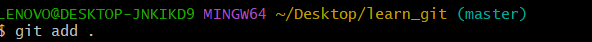
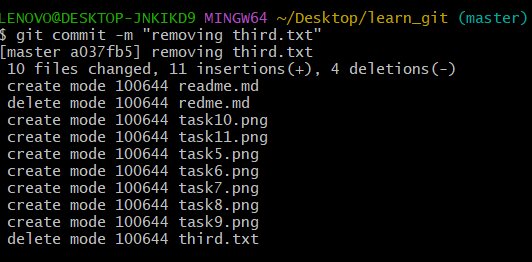
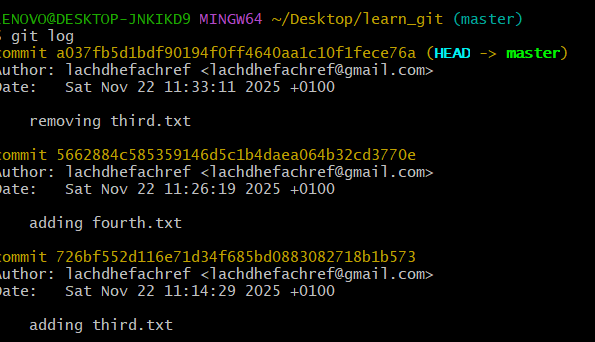

question 1 :

question 2 :

question 3 :

question 4 :

question 5 :

question 6 :

question 7 :

question 8 :

question 9 : 

question 10 :

question 11 :

question 12 :

question 13 : 

question 14 :

question 15 :

question 16 :

